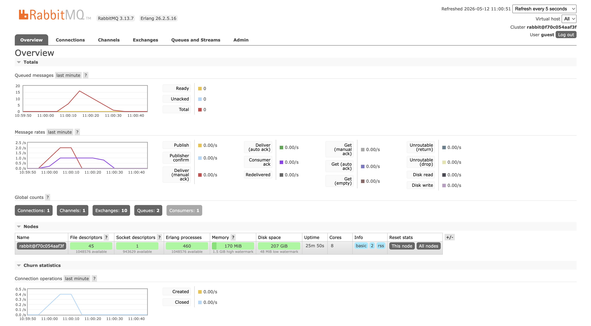

1. AMQP (Advanced Message Queuing Protocol) is an open standard protocol for message-oriented middleware that allows for the exchange of messages between applications regardless of the platform or language used.
2. First guest: The username needed to enter. Second guest: The password needed to enter. localhost: Tells the program that the post office is running on your own computer. 5672: The port number.
---

What Happened: When the publisher was run multiple times in quick succession, it sent a total of 15 events to the broker almost instantly.